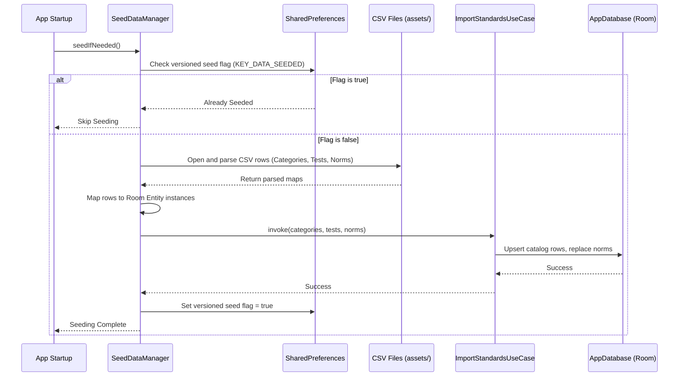
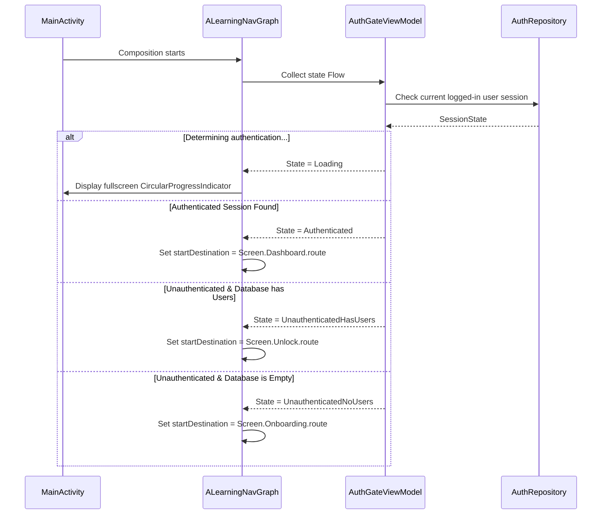

# Field — Development Context

This document serves as the unified source of truth and architectural reference for the **Field** application. Field is an offline-first fitness testing and performance tracking Android application designed for coaches, PE teachers, and fitness professionals.

---

## 1. Architectural Blueprint (Clean Architecture)

Field is built adhering to Clean Architecture principles, structuring code into three distinct packages with strict dependency directions:

```
Presentation Layer (ui/) ──> Domain Layer (domain/) <── Data Layer (data/)
```

### Dependency Rules:
1. **Domain Layer (`domain/`)**: Independent of any framework, database, or UI library. Contains pure Kotlin models, repository interfaces, and use cases. Absolutely no imports from Android or Room.
2. **Data Layer (`data/`)**: Implements repository interfaces defined in the domain layer. Handles persistence via Room DB, handles data mapping between entity and domain models (using `toDomain()` and `toEntity()`), and performs CSV parsing.
3. **Presentation Layer (`ui/`)**: Built using Jetpack Compose, Material 3, and Kotlin Coroutines/Flows. Views are bound to ViewModels, which expose a single `StateFlow<UiState>` and receive screen actions as a sealed interface. ViewModels depend exclusively on use cases (or repositories in rare cases).

---

## 2. Presentation / UI Layer

### ViewModels & StateFlow Contract
- ViewModels inherit from Android `ViewModel` and are annotated with `@HiltViewModel`.
- A single `StateFlow<ScreenUiState>` is exposed. This state must include `isLoading: Boolean` and `errorMessage: String?`.
- UI interactions are dispatched to ViewModels as a single sealed interface (`ScreenAction`) via a unified `onAction(action)` method.
- ViewModels read route arguments using `SavedStateHandle` rather than receiving navigation callbacks.

### Screen Inventory and Route Definitions
All routes are defined as objects in [Screen.kt](file:///c:/Users/APF/AndroidStudioProjects/Alearning/app/src/main/java/com/vamshi/field/ui/navigation/Screen.kt):

| Screen | Nav Route | ViewModel | Primary Responsibility |
|---|---|---|---|
| **Unlock** | `"unlock"` | `UnlockViewModel` | Returning-coach "Welcome back" password unlock (PBKDF2 hash check), keyed by resolved account ID rather than a typed username. |
| **Onboarding** | `"onboarding"` | `OnboardingViewModel` | First-launch account creation: Coach Name + Password (+ optional Email for Drive backup). Generates a username automatically. |
| **RestoreBackup** | `"restore_backup"` | `RestoreBackupViewModel` | Pre-auth Google Drive restore for a reinstalling coach; re-establishes account + session without a password. |
| **Dashboard** | `"dashboard"` | `DashboardViewModel` | Home hub: displays statistics, recent events, and quick actions. |
| **Roster** | `"roster"` | `RosterViewModel` | Group creation, athlete registration, and roster management. |
| **Athletes** | `"athletes"` | (Shared/Roster UI) | Read-only listing of all athletes with navigation to dashboards. |
| **TestLibrary** | `"test_library"` | `TestLibraryViewModel` | Categorized list of fitness tests, units, and descriptions. |
| **CreateEvent** | `"create_event"` | `CreateEventViewModel` | Setup event details, associate tests, and select target athlete group. |
| **TestingGrid** | `"testing_grid/{eventId}/{groupId}"` | `TestingGridViewModel` | Grid of athletes × tests. Facilitates live staging and submission. |
| **Stopwatch** | `"stopwatch/{eventId}/{fitnessTestId}/{groupId}"` | `StopwatchViewModel` | Live capture stopwatch (individual/group modes, trials support). |
| **Leaderboard** | `"leaderboard/{eventId}/{groupId}/{mode}"` | `LeaderboardViewModel` | Rank entries for testing events (event-based or all-time). |
| **GroupOverview** | `"group/{groupId}"` | `GroupOverviewViewModel` | Detailed group metrics, sessions history, and analytics. |
| **SessionReport** | `"group/{groupId}/session/{sessionId}"` | `SessionReportViewModel` | Historical event performance report (flags, distributions, resume). |
| **AthleteDashboard** | `"athlete/{athleteId}"` | `AthleteDashboardViewModel` | Individual longitudinal profile, test summaries, and Sparklines. |
| **AthleteTestDetail** | `"athlete/{athleteId}/test/{testId}"` | `AthleteTestDetailViewModel` | Historical charts, progress indicators, and test-specific attempts. |
| **Analytics** | `"analytics"` | `AnalyticsViewModel` | Group trends, insights, and remediation listings (e.g. <30th percentile). |

### Composable Design System & UI Rules
- **State Hoisting**: Screen composables accept a read-only `UiState` and a callback lambda `(ScreenAction) -> Unit`.
- **Predefined Performance Color Zones**:
  - **Green (Superior/Healthy)**: Percentile $\ge 60$
  - **Yellow (Healthy/Borderline)**: Percentile $30$ to $59$
  - **Red (Needs Improvement)**: Percentile $< 30$
  - **Grey (No Reference)**: Null or no matching norm percentile found.
- **Medical Warnings**: Displayed with prominent red text/backgrounds accompanied by warning icons.

---

## 3. Domain Layer

Contains the pure business logic. It defines the models, repositories, and use cases.

### Core Models
- **`Individual`**: Represents an athlete (ID, name, date of birth, biological sex, medical alert flags, active status).
- **`Group`**: Athlete groups/squads/classes (ID, name, category, cycle, location).
- **`FitnessTest`**: Test metrics (ID, name, unit, isHigherBetter flag, timing modes, validation ranges).
- **`NormReference`**: Percentile norms indexed by test, sex, age ranges, and score intervals.
- **`TestingEvent`**: Event metadata (ID, name, date, location, notes, associated tests).
- **`TestResult`**: Finalized test score records including age snapshots and percentile calculations.

### Functional Use Cases
Use cases are divided into namespaces corresponding to core areas:
- **`auth`**: `OnboardingUseCase`, `UnlockUseCase`, `SignOutUseCase`, `GenerateUsernameUseCase`, `GetPrimaryAccountUseCase`, `ListAccountsUseCase`, `CompleteRestoreUseCase`, `ObserveCurrentUserUseCase`, `ValidateNameUseCase`, `ValidatePasswordUseCase`, `ValidateUsernameUseCase`
- **`people`**: `RegisterAthleteUseCase`, `CreateGroupUseCase`, `ManageRosterUseCase`
- **`standards`**: `CalculatePercentileUseCase`, `GetTestLibraryUseCase`, `ImportStandardsUseCase`
- **`testing`**: 
  - *Setup & Entry*: `CreateEventUseCase`, `GetTestingGridDataUseCase`
  - *Staging & Staged Data*: `StagePendingEntryUseCase`, `ObservePendingEntriesUseCase`, `ClearPendingEntryUseCase`, `DiscardPendingEntriesUseCase`, `SubmitPendingEntriesUseCase`
  - *Stopwatch Timing*: `StopwatchSessionUseCase`
  - *Reports & Leaderboards*: `GetAthleteProfileUseCase`, `GetAthleteRadarDataUseCase`, `GetGroupLeaderboardUseCase`, `GetGroupProgressUseCase`, `GetIndividualProgressUseCase`, `GetRemediationListUseCase`, `RecordTestResultUseCase`
- **`reports`**: `ClassifyPercentileUseCase`, `CalculateAthleteSessionAvgUseCase`, `CalculateGroupDistributionUseCase`, `GetAthleteFlagsUseCase`

---

## 4. Data / Repositories Layer

Handles data persistence, mappings, and external data parsing.

### Local Room Database (`AppDatabase` - Version 11)
An offline-first Room SQLite implementation containing the following tables:
- `individuals`: Athlete profile records.
- `groups`: Group records.
- `group_members`: Junction table for many-to-many relationship between individuals and groups.
- `test_categories`: Fitness test category metadata (e.g. Muscular Strength).
- `fitness_tests`: Definitions of fitness tests.
- `norm_references`: Core table for age/sex/score-based percentile mapping.
- `testing_events`: Testing event sessions.
- `event_test_cross_ref`: Many-to-many event-test relationships.
- `test_results`: Finalized result scores with percentile snapshots.
- `users`: Registered coaches (IDs, user names, salt/password hashes, optional email, legacy security-question credentials).
- `pending_test_entries`: Staged, in-flight grid scores that survive app process death during live testing sessions.

### Seeding Mechanism
On first launch, [SeedDataManager](file:///c:/Users/APF/AndroidStudioProjects/Alearning/app/src/main/java/com/vamshi/field/data/seed/SeedDataManager.kt) parses CSV data from assets (`test_categories.csv`, `tests.csv`, `norms.csv`, `recommendation_categories.csv`, `recommendation_tests.csv`) and seeds the SQLite tables using `ImportStandardsUseCase` and `ImportRecommendationsUseCase`.
- Guarded by a versioned SharedPreferences key (`KEY_DATA_SEEDED` in `SeedDataManager`, currently `data_seeded_csv_v12`). Bump the version suffix to ship catalog updates to existing installs.
- Reseeding is non-destructive for user data: catalog tests/categories are **upserted** in place (user results hold foreign keys to them), while `norm_references` and the recommendation tables are replaced wholesale (nothing references them). Coach-created events, results, athletes, and groups are never touched. Catalog rows removed from newer CSVs remain in the DB, since existing results may reference them.
- Demo athletes/groups/events are only seeded when the `individuals` table is empty (i.e., a truly fresh install).

---

## 5. Key Data Flow Diagrams

### 5.1 Seeding Flow (First Launch)


### 5.2 Score Entry Flow in Live Grid (Staging to Final Submission)
```mermaid
sequenceDiagram
    participant Screen as TestingGridScreen (Compose)
    participant VM as TestingGridViewModel
    participant StageUC as StagePendingEntryUseCase
    participant SubmitUC as SubmitPendingEntriesUseCase
    participant CalcUC as CalculatePercentileUseCase
    participant DB as AppDatabase (Room)

    Note over Screen,VM: Live Score Entry Dialog
    Screen->>VM: onAction(OnSaveScore(value))
    VM->>StageUC: invoke(eventId, athleteId, testId, rawScore)
    StageUC->>DB: Insert staged entry into pending_test_entries
    DB-->>StageUC: Success (survives process death)
    StageUC-->>VM: Flow re-emits pending updates to grid UI

    Note over Screen,VM: Coach taps "Submit All"
    Screen->>VM: onAction(OnSubmitAll)
    VM->>SubmitUC: invoke(eventId)
    SubmitUC->>DB: Query all rows in pending_test_entries for eventId
    DB-->>SubmitUC: List<PendingTestEntryEntity>
    loop For each pending entry
        SubmitUC->>CalcUC: invoke(testId, rawScore, age, sex)
        CalcUC->>DB: Query norm_references (SQL match)
        DB-->>CalcUC: PercentileResult
        SubmitUC->>DB: Insert finalized TestResultEntity
        SubmitUC->>DB: Delete processed PendingTestEntryEntity
    end
    DB-->>SubmitUC: Database Transact Success
    SubmitUC-->>VM: Success
    VM-->>Screen: Re-query grid; display finalized color zones
```

### 5.3 Auth Gate Flow (Initial Destination Resolution)


### 5.4 Stopwatch Session Lifecycle
```mermaid
sequenceDiagram
    participant Screen as StopwatchScreen
    participant VM as StopwatchViewModel
    participant UC as StopwatchSessionUseCase
    participant DB as AppDatabase (Room)

    Screen->>VM: loadSession()
    VM->>UC: invoke(eventId, testId, groupId)
    UC->>DB: Fetch athletes & completed trial counts
    DB-->>UC: Return lists
    UC-->>VM: Return StopwatchSession details (heats, timingMode)
    VM-->>Screen: Display stopwatch controls (Individual or Group mode)
    
    Note over Screen,VM: Tapping Start/Stop
    Screen->>VM: onAction(OnStartStop)
    VM->>VM: Start System.nanoTime() ticker job
    VM-->>Screen: Emits ticking ms to UI
    
    Screen->>VM: onAction(OnFinishTap)
    VM->>VM: Store score in local state map (pendingResults)
    
    Note over Screen,VM: Tapping Save/Submit
    Screen->>VM: onAction(OnSubmitPending)
    VM->>DB: Write scores using RecordTestResultUseCase
    DB-->>VM: Success
    VM->>VM: Clear local pendingState & update completed count
    VM-->>Screen: Show completed status; navigate back
```

---

## 6. Gap Analysis & Technical Debt

1. **Misplaced UI Components Package (`reports/components`)**:
   - *Issue*: Custom charts and chips (`NormBandLineChart`, `MiniSparkline`, `AthleteRow`, etc.) are located in `com.vamshi.field.reports.components` in the root source directory.
   - *Impact*: Violates Clean Architecture package boundaries. UI components should reside within the `ui/` package under a common reports folder.
2. **Direct Repository Access from Presentation Layer**:
   - *Issue*: `TestingGridViewModel` and `StopwatchViewModel` make direct queries to `TestingRepository.getEventById()` and `deleteResultById()` instead of invoking Domain Use Cases.
   - *Impact*: Weakens decoupling. ViewModels should depend exclusively on use cases to keep core query/deletion business rules central.
3. **Database Schema Export & Migration Validation**:
   - *Issue*: Schema exporting is disabled in the database configuration: `@Database(..., exportSchema = false)`.
   - *Impact*: Inability to run automated compile-time Room schema verification tests. Changes to Room schemas (such as the addition of tables from version 3 through 8) are tested only during manual app runtime.
4. **Outdated Documentation**:
   - *Issue*: `CLAUDE.md` documents database schema version as 7 and the seeding SharedPreferences flag as `data_seeded_v6`. The actual codebase has progressed to database version 8 and flag `data_seeded_csv_v9`.
   - *Impact*: Causes developer confusion and context drift.

---

## 7. Specialized Antigravity Skills Configuration

To support autonomous implementation of upcoming sports fitness features, the following specialized custom skills must be provisioned within the Antigravity workspace:

### 1. Room Migration Validator
- **Role**: Automate database schema exports and migration assertions.
- **Commands**:
  - Run database migration tests: `./gradlew :app:testDebugUnitTest --tests "com.vamshi.field.data.migration.*"`
- **Workflow**:
  - Set `exportSchema = true` in `AppDatabase.kt`.
  - Configure `room.schemaLocation` in `app/build.gradle.kts` to point to a local directory inside the project.
  - Create a migration test class (`MigrationTest.kt`) using Room's `MigrationTestHelper` to verify structural transitions (like 7 $\rightarrow$ 8) without data corruption.

### 2. Compose Performance Auditor
- **Role**: Detect recomposition bottlenecks and enforce performance color-zone rules.
- **Commands**:
  - Compile-time compose metrics: `./gradlew assembleRelease -PcomposeCompilerMetrics=true`
- **Workflow**:
  - Parse generated compiler reports to detect unstable classes in view states.
  - Scan Composable lists (`LazyColumn`, `LazyRow`) to ensure standard `key` parameter usage is present.
  - Validate that custom screen views adhere to the standard percentile color zones ($\ge 60$ Green, $30\text{-}59$ Yellow, $<30$ Red).

### 3. Clean Architecture Conformance Checker
- **Role**: Assert strict package dependencies using a static import analysis script.
- **Commands**:
  - Run package verification tool: `python scripts/check_architecture.py`
- **Workflow**:
  - Run regex scans on Kotlin files import headers.
  - Assert that files under `com/vamshi/field/domain` never import packages from `data/` or `ui/`.
  - Assert that files under `com/vamshi/field/ui` never import `data/local`, `data/repository`, or `data/mapper` components directly.

---

## 8. Future Roadmap

### Phase 1: Architectural Simplification (Tech Debt Cleanup)
- Move all classes inside `com.vamshi.field.reports.components` package to `com.vamshi.field.ui.reports.components`.
- Refactor all import statements in `AthleteDashboardScreen`, `AthleteTestDetailScreen`, `GroupOverviewScreen`, and `SessionReportScreen`.
- Verify compilation using `gradlew assembleDebug`.

### Phase 2: Complete Use Case Boundaries
- Create `GetEventUseCase` and `DeleteResultUseCase` within `domain/usecase/testing/`.
- Replace direct `TestingRepository` bindings inside `TestingGridViewModel` and `StopwatchViewModel` with these use cases.

### Phase 3: DB Schema Safeguards
- Update `exportSchema = true` in `AppDatabase`.
- Set up schema storage location in `app/build.gradle.kts`:
  ```kotlin
  ksp {
      arg("room.schemaLocation", "$projectDir/schemas")
  }
  ```
- Write Room migration test assertions to verify transitions v3 $\rightarrow$ v8.

### Phase 4: Composable Optimizations
- Audit scrollable lists in `RosterScreen`, `AthletesScreen`, and `LeaderboardScreen` to verify item keys.
- Ensure all UiStates project immutable, `@Stable` domain models to maximize Compose runtime performance.
